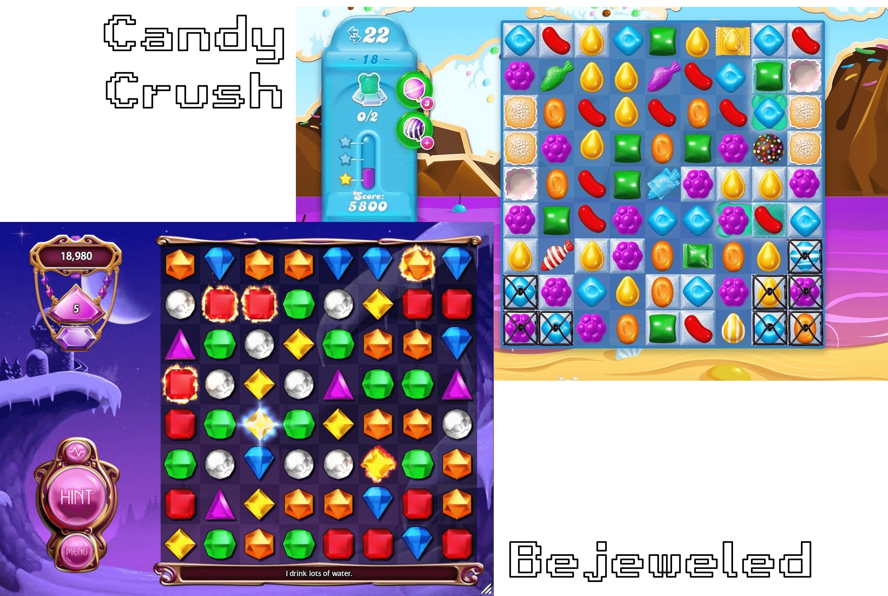
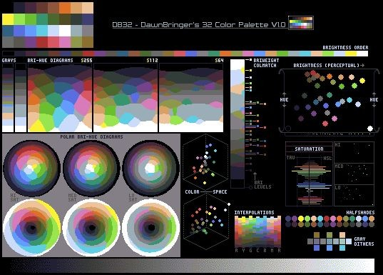
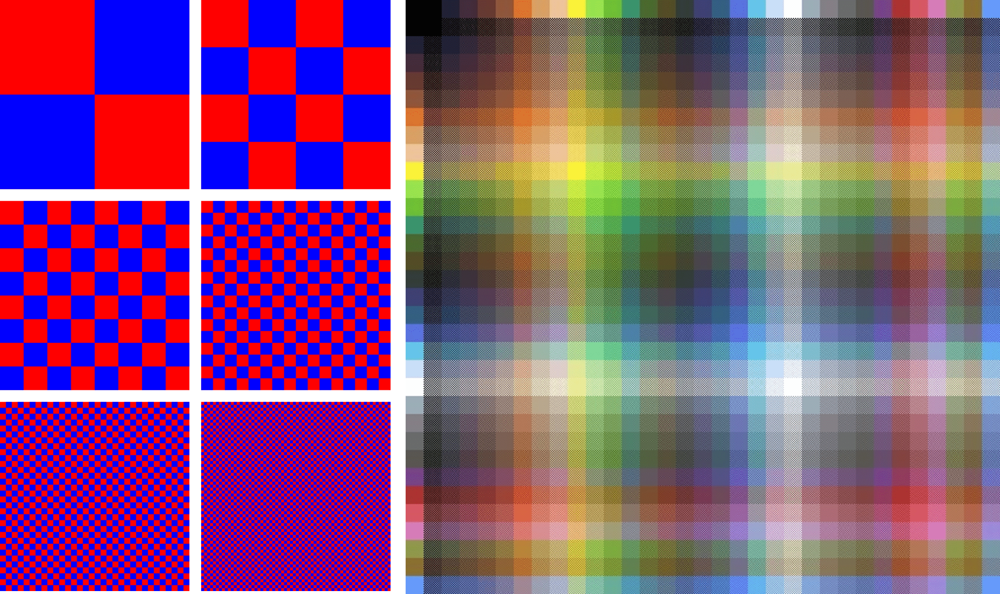
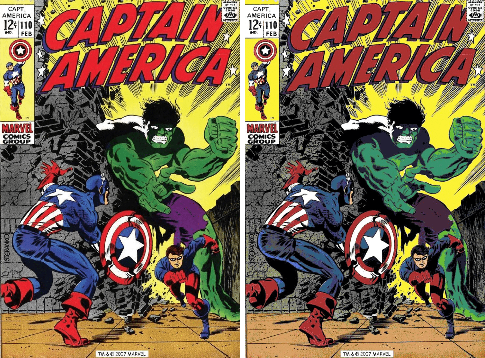
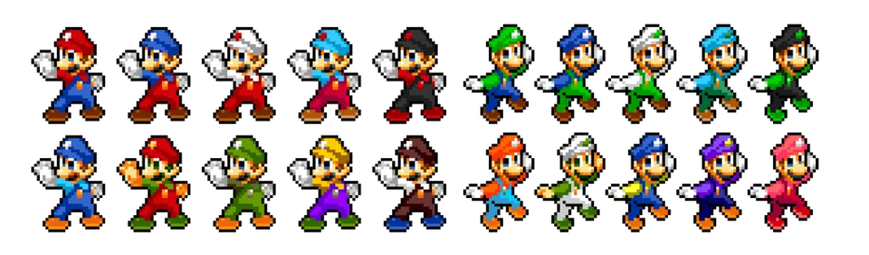
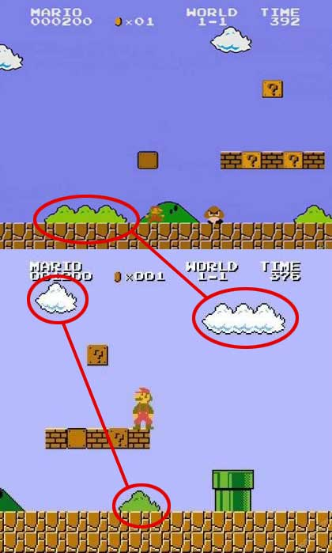

# 🧩 Match 3

You can view the pretty version of the notes [here](https://jac-cs-game-programming-f23.github.io/Notes/#/2-Match-3/).

## 🎯 Objectives

- **Tweening**: Tweening will allow us to interpolate a value within a range over time.
- **Timers**: We will learn how to make things happen within a range of time and/or after a certain amount of time has passed.
- **Solving Matches**: This is the heart of Match 3; we'll discuss how we can actually solve matches in order to progress the game.
- **Procedural Grids**: We'll discuss how to randomly generate levels using procedural grids for our Match 3 game.
- **Sprite Art and Palettes**: This is a fundamental part of 2D game development. We'll discuss how to create sprites and colour palettes for our game.

Match-3 has taken several forms over the years, with its roots in games like Tetris in the 80s. Bejeweled, in 2001, is probably the most recognized version of this game, as well as Candy Crush from 2012, though all these games owe Shariki, a DOS game from 1994, for their inspiration. The goal of the game is to match any three tiles of the same pattern by swapping any two adjacent tiles; when three or more tiles match in a line, those tiles add to the player's score and are removed from play, with new tiles coming from the ceiling to replace them.



_Images from [Medium](https://medium.com/@john_23522/a-brief-history-of-match-three-games-31233dcdfcc5)_

## 🔨 Setup

1. Clone the repo (or download the zip) for today's lecture, which you can find [here](https://github.com/JAC-CS-Game-Programming-F23/2-Match-3).
2. Open the repo in Visual Studio Code.
3. Start Visual Studio Code's "Live Server" extension. If you don't have it installed:
   1. Click on the extensions icons in the left-hand side navigation.
   2. Search for "Live Server".
   3. Click install next to the extension by "Ritwick Dey". You may have to reload the window.

      

   4. Once it's installed, click "Go Live" on the bottom right of the window. This should start the server and automatically open a new tab in your browser at `http://127.0.0.1:5500/` (or whatever port it says on your machine).
      - The files the server serves will be relative to the directory you had open in VSC when you hit "Go Live".

## 🌅 Match-3-0 (The "Day-0" Update)

Match-3-0 builds the board and populates it with randomly generated tiles.

### Colour Palettes

- A colour palette is a set of colours chosen by the designer to give the project a consistent aesthetic throughout.
- The sprite sheets and assets we have been using in this course were created using [DB32 - DawnBringer's 32 Color Palette (V1.0)](https://lospec.com/palette-list/dawnbringer-32):

  

    _Image from [PixelJoint](http://pixeljoint.com/forum/forum_posts.asp?TID=16247)_

- The idea behind using a palette is that it allows you to _dither_ (i.e., interleave two colours pixel by pixel to approximate another colour) such that your games can look like they use many colours, when in reality you only have a small set (in this case 32) available to you.

  

    _Image from [Wikipedia](https://en.wikipedia.org/wiki/Dither)_

- When applied in the proper context, the difference between a dithered image and an image that actually uses hundreds of thousands of colours can be quite minimal:

  

  _Left image has 101 845 colorus, right image has 32._

- However, the more realistic the original image is, the less effective dithering becomes:

  

  _Left image has 40 144 colours, right image has 32._

### Palette Swapping

- Palette swapping is the practice of using the same sprite for two different graphics, but with a different palette for each, such that the resulting sprites are noticeably distinct from one another.

  

- For example, a bush and a cloud could share the same sprite 🤯:

  

    _Image from [TodayIFoundOut](https://www.todayifoundout.com/index.php/2010/01/the-clouds-and-bushes-in-super-mario-bros-are-the-same/)_

### Code Restructuring

If we go back to Breakout-8 for a moment and look at the file structure, we can see that we jammed everything into the `src` folder. This worked fine for games like Pong and Breakout, but as our games become more complex and the number of files grows, this will get unmanageable. Take a look at Match-3-0 and examine the file structure:

```text
Match-3-0
│   index.html
│
├───assets
│   └───images
│           sprite_sheet.png
│
├───lib
│       DrawingHelpers.js
│       Game.js
│       Graphic.js
│       Images.js
│       RandomNumberHelpers.js
│       Sprite.js
│       State.js
│       StateMachine.js
│
└───src
    │   config.json
    │   enums.js
    │   globals.js
    │   main.js
    │
    ├───objects
    │       Board.js
    │       Tile.js
    │
    └───states
            PlayState.js
```

- `assets/`: Where we will keep all the fonts/sounds/images for the game.
- `lib/`: All of the files that help us make a game, but are not specifically tied to one game in particular. In other words, the files in here are the framework we're building with which to create games.
  - `DrawingHelpers.js`: Contains a helper function to draw a rounded rectangle.
  - `Images.js`: Maintains an object with all the `Graphic` objects which can be referenced/drawn at any point in the game.
- `src/`: All of the code that is specific to the game.
  - `config.json`: Contains configuration data required to load in the game assets. Before, we were doing this inside of `globals.js`. We always want to think about "separation of concerns" in software development, and game development is no exception. `globals.js` was getting too bloated, so we decided to separate the specific configuration for the game from the actual global variables.
  - `enums.js`: Too many magic strings and numbers in your program? Enums to the rescue! Here we define enums for things like state names, sound names, and image names. In particular for Match 3, we will also have our tile colours and patterns in here as well.
  - `globals.js`: The variables that could potentially be used anywhere in our game.
  - `main.js`: The entrypoint and _bootstrap_ for the game. In software development, the term _bootstrap_ generally refers to the place in your code that things are loaded/initialized for the first time before executing the main part of the program. For us, that means loading all the assets and states into the state machine. Then, we create a new `Game` object, pass in the state machine, and we're ready to play!
  - `objects/`: Game objects are the various components of our game. In the case of Match 3, we have a `Board` that is made up of many `Tile` objects.
  - `states/`: This should be familiar to you by now! This folder will contain all of the different states for our game which will be contained in the global state machine.

### Important Code

- In `Board.js` we're generating our tile sprites by calling our helper method, `generateSprites()`, from `Tile.js`:

  ```javascript
  generateSprites() {
      const ROWS = 9;
      const COLUMNS = 6;
      const SPLIT_POINT = 2;
      const sprites = [];
      let x = 0;
      let y = 0;
      let counter = 0;

      for (let row = 0; row < ROWS; row++) {
          for (let i = 0; i < SPLIT_POINT; i++) {
              sprites[counter] = [];

              for (let column = 0; column < COLUMNS; column++) {
                  const sprite = new Sprite(images.get(ImageName.SpriteSheet), x, y, Tile.SIZE,   Tile.SIZE);

                  sprites[counter].push(sprite);
                  x += Tile.SIZE;
              }

              counter++;
          }

          y += Tile.SIZE;
          x = 0;
      }

      return sprites;
  }
  ```

- Unlike the bricks in Breakout, the tiles in Match 3 will always remain in a full grid, which we implement as an 8-by-8 2D array. Within the 2D array, we represent each tile as an array containing `x` and `y` coordinates as well as a reference to the tile sprites. We set up the board by calling a helper function, `initializeBoard()`, from within the board's constructor:

  ```javascript
  initializeBoard() {
      const colourList = [
          TileColour.Beige,
          TileColour.Pink,
          TileColour.Purple,
          TileColour.LightGreen,
          TileColour.Blue,
          TileColour.Orange,
      ];
      const patternRange = [TilePattern.Flat, TilePattern.Flat];
      const tiles = [];

      for (let row = 0; row < Board.SIZE; row++) {
          tiles.push([]);

          for (let column = 0; column < Board.SIZE; column++) {
              const colour = pickRandomElement(colourList);
              const pattern = getRandomPositiveInteger(patternRange[0], patternRange[1]);
              const tile = new Tile(column, row, colour, pattern, this.tileSprites);

              tiles[row].push(tile);
          }
      }

      return tiles;
  }
  ```

- `PlayState` then calls the board's `render()` function to draw the board by looping through the 2D array and drawing each individual tile sprite at its `x` and `y` coordinates.

## 🔄 Match-3-1 (The "Swap" Update)

Match-3-1 allows the player to swap two tiles on the board. This implementation uses keyboard input to traverse the tiles using `w`, `a`, `s`, and `d`, select tiles with the `enter` key, and does not enforce any rules for which tiles can be swapped.

### Important Code

- We've added 2 new variables to `PlayState` to keep track of the highlighting and selection behavior:

  ```javascript
  this.cursor = { boardX: 0, boardY: 0 };
  this.selectedTile = null;
  ```

  - The `cursor` is what the player will control to be able to move around the board.
  - The `selectedTile` will turn brighter when the player hits `enter` on the tile the cursor is currently pointing at.

- `updateCursor()` monitors whether the player has pressed `w`, `a`, `s`, or `d`, and if so, we move them around our 2D tile array accordingly:

  ```javascript
  updateCursor() {
      let x = this.cursor.boardX;
      let y = this.cursor.boardY;

      if (keys.w) {
          y = Math.max(0, this.cursor.boardY - 1);
      }
      else if (keys.s) {
          y = Math.min(Board.SIZE - 1, this.cursor.boardY + 1);
      }
      else if (keys.a) {
          x = Math.max(0, this.cursor.boardX - 1);
      }
      else if (keys.d) {
          x = Math.min(Board.SIZE - 1, this.cursor.boardX + 1);
      }

      this.cursor = this.board.tiles[y][x];
  }
  ```

- Recall that the way to index into a 2D array (i.e., an array of arrays) is by specifying `array[row][column]`, so `array[0][0]` would be the top-left element in the 2D array, and `array[1][2]` would be the third element in the second row.
- In `PlayState::update()` we monitor whether the player has pressed "enter" to select a tile. Once two tiles have been selected, we swap them in `Board::swapTiles()` by swapping their place in our 2D array as well as swapping their coordinates on the grid:

  ```javascript
  const temporaryTile = new Tile(selectedTile.boardX, selectedTile.boardY);

  selectedTile.x = highlightedTile.x;
  selectedTile.y = highlightedTile.y;
  highlightedTile.x = temporaryTile.x;
  highlightedTile.y = temporaryTile.y;

  selectedTile.boardX = highlightedTile.boardX;
  selectedTile.boardY = highlightedTile.boardY;
  highlightedTile.boardX = temporaryTile.boardX;
  highlightedTile.boardY = temporaryTile.boardY;

  this.tiles[selectedTile.boardY][selectedTile.boardX] = selectedTile;
  this.tiles[highlightedTile.boardY][highlightedTile.boardX] = highlightedTile;
  ```

- Finally, in addition to handling the rendering of the board as before, `PlayState::render()` now contains some additional logic in order to display the highlighting of selected and highlighted tiles.

## ⏲️ Match-3-2 (The "Tween" Update)

Match-3-2 adds the functionality to animate the tiles being swapped on the board. To understand how these animations work, we must first understand the concepts of _timers_ and _tweens_.

### Timers

So far we've only had one notion of time in our games, namely, delta time. Since delta time is the time elapsed since the last frame was drawn, we can use this value to implement a more concrete timer mechanism.

#### Timer-0 (The "Simple" Way)

Timer-0 renders a blank screen with the following text drawn in the center: "Current Second: x seconds", where x is an integer counting up from 0 once per second.

##### Important Code

- In `main.js` we're setting up the game loop as usual. We're not going to use the `Game` class for the next few examples since these aren't technically "games".
- `update()` increments our timer:

  ```javascript
  function update(dt) {
      secondTimer += dt;

      if (secondTimer > 1) {
          currentSecond++;
          secondTimer = 0;
      }

      render();
  }
  ```

- Finally, `render()` displays our text and timer to the screen.
- This implementation is not ideal... Can you think of why?

#### Timer-1 (The "Not-Scalable" Way)

Timer-1 renders a screen with the text "Counter `i`: `x` (every `y`s)" displayed in five rows, where `x` is an integer counting up from 0, and `y` is an integer representing how many seconds have passed between each increment of `x`.

##### Important Code

- Take a look again at `main.js`. This should make the problem with our implementation clearer. This program simulates a situation in which we might need several tasks to perform some action at different times. With the way we've chosen to approach this problem, you'll notice that our code begins to get  progressively messier as we introduce additional `counter` and `timer` variables:

  ```javascript
  secondTimer += dt;

  if (secondTimer > 1) {
      currentSecond++;
      secondTimer = 0;
  }

  secondTimer2 += dt;

  if (secondTimer2 > 2) {
      currentSecond2++;
      secondTimer2 = 0;
  }

  secondTimer3 += dt;

  if (secondTimer3 > 4) {
      currentSecond3++;
      secondTimer3 = 0;
  }

  // Repeat for as many timers as you may have.
  ```

Surely there is a better way to do this than initializing all these variables and cramming our `update()` with separate logic for each of them?

#### Timer-2 (The "Clean" Way)

Timer-2 behaves exactly like Timer-1 but is written with a much better design.

##### Important Functions

- You'll notice at the top of `main.js` that we are importing a `Timer` class, which we've added to our project directory:

```javascript
import Timer from "./Timer.js";
```

- This will simplify our code greatly, but before we dive into the rest of it, take a moment to familiarize yourself with the following functions:
  - `Timer::addTask(action, interval, duration, callback)`
    - `action`: The function to execute after a certain period of time.
    - `interval`: How often the action should execute (frequency).
    - `duration`: How long the task will be tracked in this.tasks.
    - `callback`: The function to execute after duration has passed.
  - `Task::update(dt)`
    - This function essentially does what we had before in Timer-1's `update()` function. After every interval, it executes the action. After the total duration, it executes the callback.

!> In 99% of cases, you should define each class in their own file. I've made an exception here for `Task` because it is only ever going to be used in `Timer`.

##### Important Code

- You'll notice at the top of `main.js` that we now store all our counters and intervals using one array called `timerDefinitions`, which allows us to loop over our definitions and add each one as a task using `timer.addTask()`, passing in our own custom functions as the `action` and `callback`. The `action` function takes care of incrementing each counter per interval. The `callback` function takes care of changing the output text colour to green once the timer task is complete:

  ```javascript
  const timerDefinitions = [
      { interval: 1, duration: 3, counter: 0, colour: 'white' },
      { interval: 2, duration: 4, counter: 0, colour: 'white' },
      { interval: 4, duration: 8, counter: 0, colour: 'white' },
      { interval: 3, duration: 9, counter: 0, colour: 'white' },
      { interval: 2, duration: 6, counter: 0, colour: 'white' },
  ];

  timerDefinitions.forEach((definition) => {
      const action = () => definition.counter++;
      const callback = () => definition.colour = 'green';

      timer.addTask(action, definition.interval, definition.duration, callback);
  });
  ```

- Now, our previously cluttered `update()` can defer all timer related logic to the `Timer` class.

  ```javascript
  function update(dt) {
      timer.update(dt);
      render();
  }
  ```

- This design is incredibly scalable. Now, if we wanted to add in additional tasks and timers, we need only make a handful of tweaks to our existing array, whereas previously we would've needed to introduce additional overhead in the form of additional variables and conditional checks.

### Tweens

If unfamiliar with the term, "tweening" (short for "in-betweening") refers to ["the process of generating intermediate frames between two images to give the appearance that the first image evolves smoothly into the second image"](https://www.webopedia.com/definitions/tweening/).

In other words, tweening simply means changing a value from one number to another over a specified length of time, with the goal of creating the illusion of motion.

#### Tween-0 (The "Simple" Way)

Tween-0 renders a screen in which the bird sprite moves across the screen from left to right, with a timer being displayed in the top-left corner.

##### Important Code

- Take note of the `DURATION` constant we've defined atop `main.js`. We use it in `update()` to ensure that our sprite takes approximately that amount of time (in seconds) to move across the screen each time the program is run.
- Also at the top of `main.js` we're creating our bird sprite (note that we've added its image file to our project directory), assigning its initial coordinate values, and initializing an `END_X` constant to hold the value of the `x` coordinate we want our sprite to have at the end of its movement.
- Now we use `Math.min()` in `update()`:

  ```javascript
  function update(dt) {
      if (timer < DURATION) {
          timer += dt;
          bird.x = Math.min(END_X, END_X * (timer / DURATION));
      }
  }
  ```

  - By using `Math.min()` here, we ensure that we don't go past our desired `END_X`. Our `timer` variable increases by `dt` each frame, so `timer / DURATION` is the ratio by which we multiply our `END_X` each frame to make it seem as if we're moving towards the right during the specified `DURATION` length.
- This program works, but just like Timer-0, it is not the optimal implementation. Take a moment to brainstorm for a potentially better approach…

#### Tween-1 (The "More-Scalable" Way)

Tween-1 operates under the same premise as Tween-0, but instead of moving one sprite across the screen, it moves 1000 sprites across the screen, each at different rates, with the same timer.

##### Important Code

- At the top of `main.js` we set up the sprites on the screen looping through a `birds` array. This loop also sets up an individual `duration` and `y` position for each bird:

  ```javascript
  const birds = [];

  for (let i = 0; i < 1000; i++) {
      birds.push({
          x: 0,
          y: Math.random() * (canvas.height - flappy.height),
          duration: Math.random() * DURATION,
      })
  }
  ```

- Each bird's `duration` and `y` position is calculated randomly. Recall that `Math.random()` by itself will generate a random float between `0` and `1`, so we have to multiply the resulting value by the maximum number we want the random number to be.
- In `update()` we loop over the birds and move each sprite across the screen using its individual `duration`:

  ```javascript
  function update(dt) {
      if (timer < DURATION) {
          timer += dt;
          birds.forEach((bird) => {
              bird.x = Math.min(END_X, END_X * (timer / bird.duration));
          });
      }
  }
  ```

- Again, this is a more scalable design, which is (usually) always better. However, the logic here is specific to a bird moving horizontally across the screen. If we had many birds moving in different directions, we would have to write a different implementation per bird.

#### Tween-2 (The "Timer::tween()" Way)

Tween-2 behaves similarly to Tween-1 but now we're using the `Timer::tween()` function, which will allow us to interpolate between any 2 values and have the implementation be uncoupled from the scenario.

##### Important Functions

- `Timer.tween(object, parameters, endValues, duration, callback)`
  - Interpolates `parameters` on a specified `object` over some `duration`, where the `endValues` are the final values of the interpolation, and a final `callback` is executed once the `duration` has passed.

##### Important Code

- This time in `main.js`:
  - We've introduced an opacity value for our birds which, when tweened, will look like the bird is fading in as it travels across the screen.
  - The starting and end position of each bird is randomized to demonstrate that we can tween any values now.
  - We pass in a `callback` to `timer.tween()` that will change the bird's sprite from when the tween is done.

  ```javascript
  birds.forEach((bird) => {
      timer.tween(
          bird,
          ['x', 'y', 'opacity'],
          [bird.endX, bird.endY, 1],
          bird.duration,
          () => bird.sprite = '🐥',
      );
  });
  ```

- This allows us to defer our `update()` function to the `Timer` class:

  ```javascript
  function update(dt) {
      timer.update(dt);
      render();
  }
  ```

Hopefully, you can appreciate how easy it is to tween values now, and you can start to see different ways that tweening can be used in a game.

### Important Code

With our new knowledge of timers and tweening, we can now implement the new `Timer` in the game so that the swapping of two tiles is animated!

- First, let's declare a global `timer` in `globals.js`:

  ```javascript
  export const timer = new Timer();
  ```

- Next, in `Board.js`, we replace the position swapping code with calls to `timer.tween()`:

  ```javascript
  timer.tweenAsync(highlightedTile, ['x', 'y'], [temporaryTile.x, temporaryTile.y], 0.2);
  await timer.tweenAsync(selectedTile, ['x', 'y'], [highlightedTile.x, highlightedTile.y], 0.2);
  ```

  - We need to `await` the tween because we want the animation to finish before proceeding with the rest of the function.

- Finally, we have to make sure we're updating the `timer` somewhere so that it can interpolate the tile coordinates on every frame. One good place to do that is `PlayState::update()`:

  ```javascript
  timer.update(dt);
  ```

## 🔍 Match-3-3 (The "Detection" Update)

Match-3-3 implements logic to detect matches of 3 or more tiles in a row or column.

### Important Algorithms

1. Starting from the top-left corner of the board (i.e. the first tile), set `colourToMatch` to the colour of the current tile.
2. Then, check the adjacent tile on the right (i.e. the second tile).
   - If the second tile is of the same colour as `colourToMatch`, increment `matchCounter`.
   - If not, set `colourToMatch` to the colour of the second tile and reset `matchCounter` to `1`.
3. Repeat this process for the subsequent tiles in that row. As soon as we reach an adjacent tile of a different colour, or the end of the row, if `matchCounter >= 3`, we add that group of tiles to a `matches` array.
4. After all rows have been checked for matches, this process is repeated for each column, going from top to bottom.
5. The result of our algorithm is a 2D array containing each array of matches, both horizontal and vertical, with each array containing an array of the tiles in the match.

[Detection Video](images/Detection.mp4 ':include :type=video controls width=100%')

### Important Code

- Find the implementation of the algorithm in `Board::calculateMatches()`.
- We call `Board::initializeBoard()` to make sure we start with a board with no matches:

  ```javascript
      this.calculateMatches();

      while (this.matches.length > 0) {
          this.initializeBoard();
      }
  ```

- We also call this method in `PlayState::selectTile()` since we want to check if there are any matches after a tile swap:

  ```javascript
  await this.board.swapTiles(this.selectedTile, highlightedTile);
  this.selectedTile = null;
  this.board.calculateMatches();
  ```

## 🏗️ Match-3-4 (The "Removal & Replacement" Update)

Match-3-4 takes care of removing and replacing the tiles that have been detected as a match.

### Important Algorithms

Now the question is how to remove our matching tiles, once we have them all in an array. You might think we'd have to do some tricky coding with their coordinates on the grid or their position on the board, but this problem is solved easier than you may think.

#### Match Removal Algorithm

1. In `Board::removeMatches()`, we loop over each array within our matches array and set the value of each tile to `null`, after which we can also set our matches array to `null`.
   - This has the effect of erasing the matched tiles array from existence. The result on the screen would be the board as it was before, but with holes where previously there would've been matches.
2. The next function in the file, `Board::getFallingTiles()`, takes care of shifting down the remaining tiles in each column if needed.
   1. Start from the bottom of each column and check each slot in the column until a `null` slot is found.
   2. Once a `null` slot is found, its position is marked and the next non-`null` tile found in the column is tweened down to the marked position.
   3. This process is iterated for each `null` slot in each column.

[Removal Video](images/Removal.mp4 ':include :type=video controls width=100%')

#### Tile Replacement Algorithm

- After we've removed matching tiles and shifted down those left over, we need to figure out how to replace the remaining `null` positions. This is done in `Board::getNewTiles()`.
  1. For each column, we count the number of `null` spaces and generate that many new tiles.
  2. Then, we can set each tile's position to be that of one of the `null` spaces, and add it to our board array.
  3. We want the animation to look like the tiles are falling into place, however, so to produce this effect, we tween each new tile from the top of the board to its final position using the `Timer` class.
- The possibility exists that the newly-generated tiles will create additional matches when they spawn, so, check for matches again (recursively) after generating the new tiles.
  - This is done in `PlayState::calculateMatches()` function, which uses the functions in `Board.js` to calculate matches, remove matches, and get falling tiles, and then recurses until it ensures that no new matches have been found.

[Replacement Video](images/Replacement.mp4 ':include :type=video controls width=100%')

### Important Code

- `PlayState::calculateMatches()`
  1. Calculates whether any matches were found on the board.
  2. If so, it removes the matched tiles and tweens the tiles above the matches to their new destinations.
  3. Generates new tiles to fill in all the new spaces and tween them to their location on the board.
  4. Calls itself recursively to resolve any new matches that may have resulted from the new tiles.
- `Board::removeMatches()`
  - Removes the matches from the board by setting the tile slots within them to `null`, then setting `this.matches` to empty.
- `Board::getFallingTiles()`
  - Shifts down all of the tiles that now have spaces below them, then returns an array that contains tweening information for these new tiles.
- `Board::getNewTiles()`
  - Scans the board for empty spaces and generates new tiles for each space.

## 💯 Match-3-5 (The "Progression" Update)

Match-3-5 adds _scoring_, _levels_, and a _timer_, such that when the player reaches a certain score on a given level before time runs out, they will go to the next level.

### Important Code

- `PlayState` has additional member variables to keep track of the `score`, `level`, and `timer`.
  - The `scoreGoal` indicates to the player how many points they need in order to ascend to the next level. This value scales by `scoreGoalScale` based on the current level.
  - The `score` is incremented in `PlayState::calculateScore()`:

    ```javascript
    this.board.matches.forEach((match) => {
        this.score += match.length * this.baseScore;
    });
    ```

  - The `timer` is decremented every second and the player must try and reach the `scoreGoal` before time runs out.

    ```javascript
    // PlayState.js
    startTimer() {
        timer.addTask(() => {
            this.timer--;

            if (this.timer <= 5) {
                sounds.clock.play();
            }
        }, 1, this.maxTimer);
    }
    ```

  - If the player reaches `scoreGoal` before time run out, they ascend to the next level:

    ```javascript
    // PlayState.js
    checkVictory() {
        if (this.score < this.scoreGoal) {
            return;
        }

        stateMachine.change(StateName.Play, {
            level: this.level + 1,
            score: this.score,
        });
    }
    ```

- We've added a new state called `GameOverState`. This prints "Game Over" on the screen as well as the player's score when the timer reaches zero. In `PlayState`, we check if time has run out:

  ```javascript
  checkGameOver() {
      if (this.timer > 0) {
          return;
      }

      stateMachine.change(StateName.GameOver, {
          score: this.score,
      });
  }
  ```

- Lastly, we utilize the state's `exit()` function to clear the timer:

  ```javascript
  exit() {
      timer.clear();
  }
  ```

## ✨ Match-3-6 (The "Polish" Update)

Match-3-6 adds an animated title screen, animated level transitions, and music. As of right now, we can swap any two tiles on the board. To make this more true to a Match 3 game, we'll add a limit to only allow the player to swap two adjacent tiles.

### Important Code

- Let's start with the new `TitleScreenState`. We've seen title screens in previous games, and this one is not much different.
  - The animated title text is done by keeping the individual letters in an array, and keeping the individual colour values in another array. We then set up a timer to shift the values of the colours array over by 1 so that when the text is rendered, it appears as if the colours are moving from letter to letter:

    ```javascript
    // TitleScreenState::constructor()
    this.titleLetters = ['M', 'A', 'T', 'C', 'H', '3'];

    this.colours = [
        [217, 87, 99, 255],
        [95, 205, 228, 255],
        [251, 242, 54, 255],
        [118, 66, 138, 255],
        [153, 229, 80, 255],
        [223, 113, 38, 255],
    ];

    // TitleScreenState::startColourTimer()
    this.colourTimer = timer.addTask(() => {
        this.colours = this.colours.slice(1).concat(this.colours.slice(0, 1));
    }, 0.1);

    // TitleScreenState::drawTitleText()
    for (let i = 0; i < this.titleLetters.length; i++) {
        const r = this.colours[i][0];
        const g = this.colours[i][1];
        const b = this.colours[i][2];

        context.fillStyle = `rgb(${r}, ${g}, ${b})`;
        context.fillText(this.titleLetters[i][0], CANVAS_WIDTH / 2 + 50 * i - 130, CANVAS_HEIGHT / 2 + offSet + 55);
    }
    ```

  - The animated background is done by creating a `new Board()` and passing in larger dimensions than the board that is used for play. There is a new function `Board::autoSwap()` that uses the timer to randomly swap two tiles. This was created for no other reason than to provide a more interesting background to look at.

- Next, we made a new `LevelTransitionState` that is in charge of animating a "level label" that comes down from the top of the screen.
  - There is too much code to paste here, so please take a look at `LevelTransitionState` and make sure you understand how these animations are being done. We're making heavy use of timers and tweens, and hopefully you can start to imagine all the cool different things you can do with this `Timer` class!

- Next, we've added music. The only difference here from our previous games is that we have multiple music tracks. The currently playing track is different depending on which state you're in. As I'm sure you're aware, it is extremely common for games to have many different music tracks based on what state/level you are currently on.
  - For example, we switch tracks like this when changing states:

    ```javascript
    // TitleScreenState.js
    exit() {
        sounds.pause(SoundName.Music);
    }

    // LevelTransitionState.js
    enter() {
        sounds.play(SoundName.Music3);
    }
    ```

- Lastly, we'll limit the player to only be able to swap adjacent tiles. To accomplish this, we take the board distance between the selected tile and the highlighted tile and check if it's greater than one. If so, that means the player is trying to swap two tiles that are more than one tile's size apart.

  ```javascript
  const tileDistance = Math.abs(this.selectedTile?.boardX - highlightedTile.boardX) + Math.abs(this.selectedTile?.boardY - highlightedTile.boardY);

  if (tileDistance > 1) {
      sounds.play(SoundName.Error);
      this.selectedTile = null;
  }
  ```

  - The `?.` syntax is called [optional chaining](https://developer.mozilla.org/en-US/docs/Web/JavaScript/Reference/Operators/Optional_chaining) which allows you to check a property on an object even if that object is `null` at the time.

And with that, we have a fully functioning game of Match 3!

## 📚 References

- [Harvard's CS50 Introduction to Game Development - Match 3](https://cs50.harvard.edu/games/2018/notes/3/)
